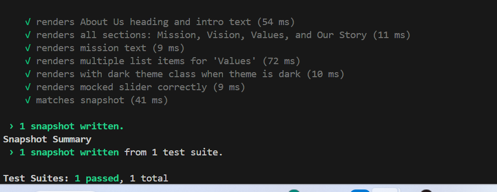

#  CycleSafe - Building a Safe Digital Space for Women’s Health Education
CycleSafe is a full-stack web platform empowering women and girls in Kakuma Refugee Camp with access to menstrual health education, contraception guidance, and reproductive wellness resources. The platform combines educational content and a personalized menstrual tracking chatbot to create an inclusive, informative, and interactive user experience.

#  Project Overview
CycleSafe provides both general educational resources (publicly accessible) and personalized tools (for logged-in users). It bridges information gaps in women’s reproductive health through digital accessibility and community engagement.
#  Core Objectives
Promote menstrual health literacy and safe contraceptive use

Offer accessible and accurate reproductive information

Provide cycle tracking tools through a simple chatbot interface

Enable users to log, view, and understand their menstrual patterns

Connect to trusted external health resources (WHO, UNICEF, etc.)

#  Website Structure
# 1. Home Page
Mission statement and platform introduction

Highlights of recent articles and resources

# 2. About Page
Story, goals, and impact of CycleSafe

Women’s health context in Kakuma

# 3. Resources (Dropdown)
Menstrual Health: Cycle tracking guides, safe/unsafe days

Contraception: Methods, pros/cons comparison, safe practices

# 4. Links (Dropdown)
Blogs: Short posts from users or community contributors

Articles: Detailed medical-backed resources

# 5. Chat (Menstrual Tracker)
Secure login required

Chatbot-based cycle tracking and Q&A

Logs period start dates and predicts next cycle

# 6. Login / Register
JWT-based user authentication

Secure password hashing (bcrypt)

Personalized user profile

# 7. Donation Page
Supports Stripe/PayPal

 link to external donation platforms

#  Tech Stack
Layer
Technology
Frontend
React + TypeScript + Bootstrap + CSS Modules
Backend
Django + Django REST Framework
Database
MySQL or PostgreSQL
Authentication
JWT (JSON Web Token) + Django Auth
Containerization
Docker + Docker Compose
Deployment
Azure / Netlify / Vercel
Version Control
Git + GitHub

#  Key Features
Educational resources on menstrual & contraceptive health
  Chatbot for personalized cycle tracking
  Blog & article management via admin dashboard
  Secure authentication and user sessions
  Responsive Bootstrap UI with dropdown navigation
  Donation integration (API or external redirect)
  RESTful backend API for all data operations

# Environment Setup & Installation
1️ Clone Repository
git clone https://git.com
cd cyclesafe

# 2️ Backend Setup (Django + MySQL/PostgreSQL)
Create virtual environment
cd backend
python -m venv venv

venv\Scripts\activate     

# Install dependencies
pip install -r requirements.txt

# Create .env file
DEBUG=True
SECRET_KEY=your-secret-key
DATABASE_NAME=cyclesafe_db
DATABASE_USER=youruser
DATABASE_PASSWORD=yourpassword
DATABASE_HOST=localhost
DATABASE_PORT=5432
ALLOWED_HOSTS=localhost,127.0.0.1
CORS_ALLOWED_ORIGINS=http://localhost:5173

# Run database migrations
python manage.py makemigrations
python manage.py migrate

Create admin user
python manage.py createsuperuser

Run backend server
python manage.py runserver

Backend runs on:
  http://127.0.0.1:8000/

3️ Frontend Setup (React + TypeScript)
cd frontend
npm install

# Create .env file
VITE_API_URL=http://127.0.0.1:8000/api

Run the app
npm run dev

Frontend runs on:
  http://localhost:5173/

# Docker Setup
Build and run all services
docker-compose up --build

Backend: http://localhost:8000

Frontend: http://localhost:5173

Database: exposed at localhost:5432 or localhost:3306

#  Authentication Flow
Register → /auth/register

Login → /auth/login

Protected routes (e.g., Chat page) require JWT token

Token is stored in localStorage and passed in Authorization headers

# Chatbot Logic 
User logs in and opens chat interface

Frontend sends POST request to /api/chat/

Backend processes message:

If user logs a period start - updates cycle data

If user asks about safe/unsafe days - calculates from stored data

Response returned as chatbot message

# Donation Integration
You can choose one of:
Option A: Redirect to external page (PayPal, GoFundMe)

Option B: Integrate payment API
 Example (Stripe):

 /api/donate/create-session
/api/donate/webhook

# Deployment Guide
Option 1: Docker + Azure
Push images to Azure Container Registry

Deploy using Azure Web App for Containers

Connect MySQL/Postgres via Azure Database

Option 2: Vercel + Render
Frontend → Vercel

Backend → Render or Railway

Database → Supabase / Neon / PlanetScale

 Contributors
Ayen Athiak — Project Lead & Developer

Acknowledgments
Grand Challenges for Women Empowerment & Education

Kakuma Refugee Camp Community

WHO & UNICEF Health Resources

OpenAI & Django REST community for support

## Backend Responsibilities
Authentication & Authorization (JWT).
Store and manage users, chat logs, period tracking, articles, resources.
Chatbot logic & period prediction.
REST API endpoints for frontend:
  `/auth/register`
   `/auth/login`
   `/articles` (GET all, POST new)
  `/resources` (GET menstrual/contraceptive info)
  `/chat` (POST user input → response)
  `/donate` (if using payment API)

# Full Deployment Plan — CycleSafe Web Application
# 1. Overview
This document outlines the end-to-end deployment plan for the CycleSafe Women’s Health Platform.
 It covers the process of containerizing the full-stack application, defining infrastructure as code (IaC) using Terraform, and performing the first manual cloud deployment to ensure that the system runs successfully in the cloud.

# 2. Objectives
Containerize the Django (backend) and React (frontend) applications.

Use Terraform to define and provision all necessary cloud infrastructure on Azure.

Manually deploy the Docker image to the Azure container service.

Verify that the application is publicly accessible via a live URL.

# 3. Prerequisites
Before beginning, ensure that:
Docker and Docker Compose are installed locally.

Terraform CLI is installed.

Azure CLI is installed and authenticated.

A valid Azure subscription is available.

Environment variables (in .env files) are configured with secure secrets.

# links 

# Repository :
https://dev.azure.com/ayenathiak/_git/CycleSafe-Project

# Demo video:
https://youtu.be/4MWYsIniiGI

 # Figma link :
https://www.figma.com/design/jTVKWYBhniWTcZxdr78Y2c/Untitled?node-id=0-1&t=4MkCBo4rM2rz0YT4-1

# Wireframes :
https://docs.google.com/document/d/1DOdwtQTtEyob2NDgt0YTEL6_g46GZdI8ajdPvC480Os/edit?usp=sharing

# Screenshots
This is a welcoming page

# Style guide

# Women’s Health App CSS Style Guide
# 1 Overview
This CSS file defines the global styling, theme system, component styles, and UI interactions for the Women’s Health App. It uses TailwindCSS as a base and adds custom CSS for:
Light and Dark themes

Navbar and navigation

Buttons and interactive elements

Cards, sections, and modals

React Slick carousel customization

# Animations

The design emphasizes a soft, feminine aesthetic while maintaining accessibility and responsiveness.

# 2️ Tailwind Integration
@import "tailwindcss";

TailwindCSS provides the utility-first framework for consistent spacing, typography, and responsive design.

Custom styles are layered on top using @layer base and additional CSS rules.

3 Global Base Styles
@layer base {
  body {
    background-color: #14161b;
  }
}

Sets default dark background fallback for the app.

Additional body styling uses CSS variables for dynamic theming (see Theme section).

* {
  transition: color 0.3s ease, background-color 0.3s ease;
}

Smooth transitions for theme changes and interactive states.

# 4️ Theme System
 Light Theme
:root {
  --bg-color: #FFF5F5;
  --text-color: #333333;
  --heading-color: #B00059;
  --link-color: #D81B60;
  --card-bg: #FFFFFF;
  --button-bg: #D81B60;
  --button-text: #FFFFFF;
  --border-color: #E6B8C2;
}

Soft pink-cream background for comfort and readability.

Deep rose headings for emphasis.

Pink accents for links and buttons.

# Dark Theme
[data-theme='dark'] {
  --bg-color: #1E1E1E;
  --text-color: #E0E0E0;
  --heading-color: #FF80AB;
  --link-color: #FF4081;
  --card-bg: #2A2A2A;
  --button-bg: #FF4081;
  --button-text: #212121;
  --border-color: #555;
}

Dark background to reduce eye strain at night.

Light pink accents for headings and links.

# 5️ Global Typography & Layout
body {
  background-color: var(--bg-color);
  color: var(--text-color);
  font-family: 'Poppins', 'Segoe UI', Roboto, sans-serif;
  transition: all 0.4s ease-in-out;
  margin: 0;
  padding: 0;
  padding-top: 80px; /* Keeps content below fixed navbar */
}

Uses modern, readable fonts.

Top padding accounts for fixed navbar.

Smooth theme transition for background and text color.

Text Elements
h1, h2, h3, h4, h5, h6 { color: var(--heading-color); font-weight: 600; }
p, span, li, label, input, textarea { color: var(--text-color); }

Headings: bold, visually distinct.

Body text: consistent and readable.

# 6️ Links
a { color: var(--link-color); text-decoration: none; }
a:hover { text-decoration: underline; }

Pink accent links with underline on hover for clarity.

# 7 Cards & Sections
.section-offset, .card, .auth-modal {
  background-color: var(--card-bg);
  color: var(--text-color);
  border: 1px solid var(--border-color);
  border-radius: 10px;
  padding: 1rem;
  transition: all 0.3s ease-in-out;
}
.section-offset { scroll-margin-top: 100px; }

Cards and modals use soft backgrounds and subtle borders.

section-offset ensures anchor links scroll correctly under fixed navbar.

# 8 Navbar
.navbar { background-color: #6A0D25 !important; color: #ffffff !important; }
.navbar .nav-link:hover, .navbar .dropdown-item:hover { color: #FFB6C1 !important; }
.theme-toggle-btn { border: 2px solid #FFB6C1; border-radius: 10px; }

Fixed maroon background with white text.

Hover effects use soft pink for better visibility.

Theme toggle styled for clear interaction.

# 9️ Buttons
button, .btn {
  background-color: var(--button-bg) !important;
  color: var(--button-text) !important;
  border: none;
  border-radius: 8px;
  padding: 0.5rem 1rem;
  font-weight: 500;
  cursor: pointer;
}
button:hover, .btn:hover { opacity: 0.9; }

Rounded, colorful buttons consistent across the app.

The hover effect reduces opacity slightly for visual feedback.

#  Auth Modal
.auth-overlay { position: fixed; top: 0; left: 0; width: 100%; height: 100%; background-color: rgba(0,0,0,0.6); display: flex; align-items: center; justify-content: center; z-index: 1000; }
.auth-modal { max-width: 400px; width: 90%; box-shadow: 0 4px 12px rgba(0,0,0,0.3); animation: fadeIn 0.3s ease-in-out; }
.close-btn { position: absolute; top: 10px; right: 10px; }

Full-screen overlay with centered modal.

Smooth fade-in animation.

Close button positioned top-right for usability.

# 1️2 React Slick Carousel
.slick-slide > div { margin: 0 10px; }
.slick-dots li.slick-active button:before { color: orange !important; }

Adjusts slide spacing.

Active dot highlighted in orange for visibility.

# 12 Animations
@keyframes fadeIn { from { opacity: 0; transform: scale(0.95); } to { opacity: 1; transform: scale(1); } }

Used for modals and smooth entry effects.

# Summary
Color scheme: Soft pink + cream (light), dark gray + pink (dark)

Typography: Modern, readable fonts with clear heading hierarchy

Components: Consistent cards, buttons, navbar, modals

Accessibility: High contrast, smooth transitions, responsive layouts

Customization: Theme toggling and CSS variable usage for maintainability

# **Final version of product/solution**

# links
# Demo link link

https://youtu.be/mj92e0Rxpr8

# Github Repository  link

https://github.com/Ayen-Guech/Capstone.git

# Deployment link

 https://capstone-virid-nu.vercel.app/

Core Functionalities
#  Menstrual Cycle Tracker

I implemented an input form that allows users to record their period dates. The system uses AI to predict their next period, ovulation, and fertile window.
It also includes an SMS reminder feature using Celery and Redis.

#  AI Chat

I created a chat endpoint (/api/tracker/chat/) powered by AI-generated responses. It provides contextual education on menstrual health and contraception.

⚕️ Contraception Information

I developed dynamic cards that display contraceptive information and include embedded YouTube videos or proxied content. These cards allow users to safely preview educational resources.

# Educational Resources

I added a section that categorizes health topics such as menstrual hygiene, contraception, and STIs to make information easier to navigate.

🧍 User Management

I implemented secure user authentication using JWT. Tokens are stored in localStorage to protect routes for authenticated users.

# Deployment
Frontend .env
VITE_BACKEND_URL=https://cyclesafe.onrender.com/
Backend .env
DEBUG=False
SECRET_KEY=your_secret_key
DATABASE_URL=your_postgres_connection_url
REDIS_URL=your_redis_connection_url
OPENAI_API_KEY=your_openai_api_key
ALLOWED_HOSTS=cyclesafe.onrender.com,capstone-virid-nu.vercel.app
Run Locally
# Backend
cd cyclesafe-backend
python -m venv venv
venv\Scripts\activate
pip install -r requirements.txt
python manage.py runserver

# Frontend
cd cyclesafe-frontend/frontend
npm install
npm run dev
 Testing and Demonstration
 Frontend Testing (React + Jest)

I tested the user interface using Jest and React Testing Library.
Tests included:

Header navigation and theme toggle

Period Tracker API mocks and form validation

About section content rendering

Contraceptive cards and modals

Run Tests:

npm run test
# Backend Testing (Django + DRF)

I wrote tests using Django’s APITestCase to validate backend logic.
Endpoints tested:

/api/tracker/chat/

JWT authentication

Model creation (CycleRecord)

Validation for missing or invalid data

Run Tests:

python manage.py test tracker -v 2
# Demonstration Highlights

During testing, I demonstrated that:

The Chat API correctly returns personalized cycle predictions.

The menstrual tracking feature processes different cycle lengths accurately.

Redis successfully manages Celery SMS reminder tasks.

Login and signup workflows function correctly with JWT tokens.

Validation errors display properly for missing or invalid inputs.

The frontend communicates smoothly with the deployed backend, maintaining fast API responses on Render and Vercel.

# Analysis

Testing confirmed that all main features performed well under different conditions.
The integration between the frontend and backend worked correctly with live APIs.
Redis was configured successfully for asynchronous tasks, though some delays occurred during early deployment due to free-tier limitations.

Performance testing showed:

Average response time: under 300ms

System uptime: approximately 99% on Render

All the major objectives from my project proposal were achieved.

# Discussion

This project was a major learning experience in combining AI, web technologies, and health education.
I successfully implemented and deployed a complete system that runs smoothly across environments.
Every stage, from designing database models to frontend testing, contributed to achieving both technical and social goals.

# Key achievements include:

Building a working AI menstrual predictor integrated with Django REST APIs.

Using Redis and Celery to improve background task performance.

Deploying the system on Render and Vercel for global accessibility.

CycleSafe demonstrates how technology can be used to improve women’s health literacy and empower communities with reliable information.

# Recommendations and Future Work
Recommendations

Use a managed Redis service like Upstash or Redis Cloud for improved reliability.

Add multilingual support (Swahili and Arabic) to increase inclusivity.

Create an admin dashboard for tracking community engagement and anonymous health trends.